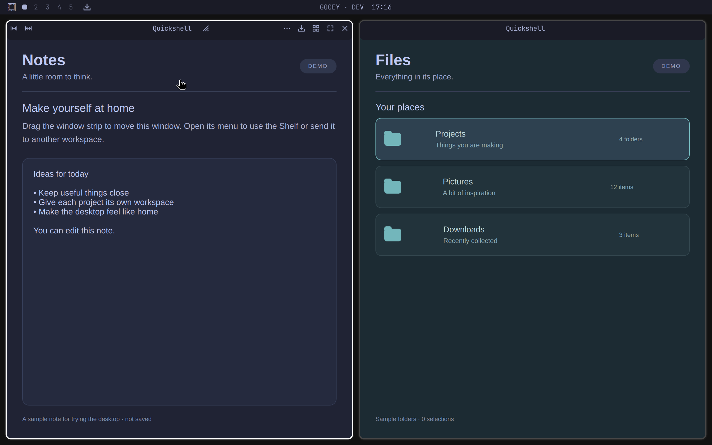

# Gooey

**Enjoy Hyprland with your mouse. Keep the keybindings you like.**

Gooey makes everyday navigation in **Hyprland with Omarchy** more mouse friendly.
It is for people who struggle to remember or learn lots of keybindings—and people
who simply do not want to memorize 30 shortcuts just to get around their desktop.

Move and resize windows, send them to another workspace, set an app aside on the
Shelf, or open your apps from visible controls. Use the mouse, keyboard shortcuts,
or a combination of both. Gooey adds another way to use Hyprland’s own window
operations, while Omarchy continues to provide your desktop and its theme.



*Actual Gooey interface with sample apps. The “GOOEY · DEV” bar identifies the
isolated screenshot environment; it is not branding added to your installed bar.*

## What you can do

- **Control each window:** close, fullscreen, send to workspace, and Shelf buttons
  attached to its native frame.
- **Move and resize:** drag the app-name area to move; drag the grip beside it to
  resize, or click that grip for size controls.
- **Use your layout:** dwindle gets split-aware resizing; scrolling gets **25%, 50%,
  85%, and 100%** column sizes plus column navigation.
- **Learn as you go:** hover over icons for short explanations. Labels stay visible
  beside the central resize grip.
- **Open apps and desktop settings:** click the Omarchy logo for the anchored
  Quickshell menu. It follows the button when you move the bar.
- **Keep Omarchy’s appearance:** colors, fonts, borders, rounding, and control
  thickness follow its theme and bar sizing.

[See every button, with close-up screenshots →](docs/USER-GUIDE.md)

## Install this source preview

**Manual setup required.** The root manifest exposes Gooey’s window-tools plugin,
but installing that manifest alone does not build or enable the native companion
or register the bundled launcher. Use the source installer below from a terminal
on the PC where you want Gooey. It builds and tests before changing the desktop.

```sh
git clone https://github.com/Minokai69/gooey-release.git
cd gooey-release
./install --check
./install --enable
```

Read the [dependencies and recovery instructions](docs/INSTALL.md) first. The build
requires a C++23 compiler, matching Hyprland development headers, pkg-config, Cairo
and PangoCairo plus the libraries named by `build.sh`. Testing needs Bubblewrap,
D-Bus, Quickshell, Hyprland, grim, and the virtual input build tools.

To remove Gooey’s active integration, run `~/.local/bin/gooey disable`.
This restores unchanged owned settings and retains backups and staged files;
it does not erase your applications or unrelated settings.

## Turn it on or off

After installing Gooey, open the **Omarchy logo → Style → Gooey**.
A check mark means it is enabled. The same entry remains available when Gooey is off.


The Style toggle selects an installed Gooey build; it does not download or build it.
You can also run `gooey disable` to restore the owned stock Omarchy settings.

[Installation, updates, and recovery →](docs/INSTALL.md)

## Early preview: supported setup

This preview targets the tested **Omarchy 4.0.3-1**, **Quickshell 0.3.1**, and
**Hyprland 0.56.2** build recorded in `HOST.json` and the native companion’s build
metadata. Matching version numbers alone are not enough: Gooey checks the shell
files and native API compatibility too.

Installation is from reviewed source. The source installer supports this pinned
host and handles explicit updates; there is no automatic update channel yet. Niri is a future
goal and is **not supported in this preview**.

The right frame button enters true fullscreen, just like **Super+F**. Hyprland
hides the frame in fullscreen, so **Super+F is the supported way back**. Choose
**Maximize** in the window menu when you want to fill the workspace and keep the
mouse controls visible. Gooey does not yet make every desktop operation mouse-only.

[Preview release notes](docs/RELEASE-NOTES.md) · [Validation and limits](docs/VALIDATION.md)

## Development

Gooey consists of two Omarchy Quickshell plugins and a version-matched native
Hyprland decoration companion. It does not replace Hyprland’s layout engine or
modify Omarchy’s package-owned files. This public snapshot omits the private development history and captured `base/`.
Tests mount your installed Omarchy read-only; `HOST.json` retains the reviewed compatibility baseline.

[Development workflow](docs/DEVELOPMENT.md) · [Product boundaries](PRODUCT.md)

Formerly **Omousey**. Existing users should disable Omousey before enabling Gooey;
see [migration instructions](docs/DEVELOPMENT.md#migrating-from-omousey).
