# Using Gooey

Gooey gives everyday Hyprland actions visible mouse controls. You can keep using
Omarchy’s shortcuts whenever they are more convenient. There is no need to choose
one input method for everything.

These are real screenshots from the isolated sample desktop, captured at 2×
output scale. Individual icons are cropped from the running interface, not redrawn.
Your colors, fonts, rounding, and sizes will follow your own Omarchy theme.

## Read the window frame

From left to right: layout-specific quick sizes, the app name and nearby resize
grip, then window actions. The name stays visible. Icons appear while the pointer
is over that window or its frame. The frame reserves space above the app, so
hovering does not rearrange the tiles or cover the application’s content.

Hover briefly over a control to see what it does:

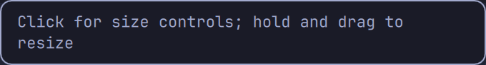

### Common window controls

| Actual icon / area | What it does | How to use it |
| --- | --- | --- |
| App name / empty frame space | Move this window through Hyprland’s native move operation. | Hold the left mouse button and drag. In a tiled layout, Hyprland controls how the tile moves. |
| 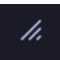 Resize grip | Open size and layout controls, or resize directly. | **Click** for the menu. **Hold and drag** to resize. Tiled resizing needs space to share with another tile. |
| 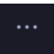 Actions | Open the window’s action menu. | Click for Shelf, workspace, Float/Tile, Maximize/Restore, layout controls, and Close. Right-clicking the frame also opens actions. |
| 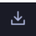 Send to Shelf | Set this window aside while keeping it running. | Click to move it to Omarchy’s scratchpad—the same Shelf used by **Super+S**. On a shelved window the action reverses to taking it off the Shelf. |
| 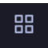 Send to workspace | Choose a destination for this window. | Click, then select a workspace. It acts on the window whose button you clicked, even if another window had focus. |
| 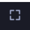 Fullscreen | Enter native fullscreen, matching **Super+F**. | Click to enter. **Press Super+F to restore**; the frame is hidden in fullscreen. |
|  Close | Ask this app window to close. | Click once. The app may show its own unsaved-work prompt. This is not a force-kill action. |

Dragging away before releasing an ordinary button cancels its click. Move and
resize grips instead start their native drag gestures. Very narrow windows use a
compact arrangement; additional actions remain in the menu. Grouped windows and
unsupported layouts restrict actions that Gooey cannot safely apply to one owner.

### Dwindle: share space between tiles

Only effective resize axes are offered. A full-height tile beside another window
shows width controls; a full-width tile above another shows height controls. A
lone dwindle tile has no neighboring tile to take space from, so these quick size
buttons are hidden. A window with both kinds of split can show both pairs.

| Icon / control | Result |
| --- | --- |
|  Narrower | Reduce this tile’s width; the neighboring tile gains space. |
| 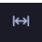 Wider | Increase this tile’s width by taking space from its neighbor. |
|  Shorter | Reduce tile height when a vertical split permits it. |
| 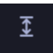 Taller | Increase tile height by sharing space with a vertically neighboring tile. |

Quick sizing requests a **200 logical-pixel adjustment per click**. Hyprland’s
layout and size limits determine the final result. It is intentionally a noticeable
step; use the resize grip for finer adjustments.

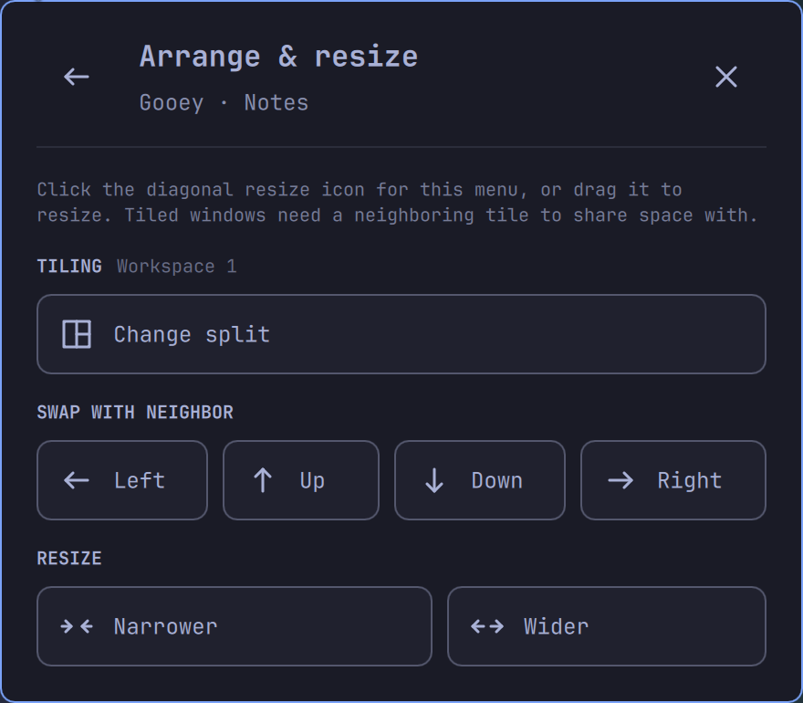

- **Change split:** switch the native dwindle split orientation.
- **Swap with neighbor:** exchange places with a neighboring tile in the indicated direction.
- **Narrower / Widen / Shorter / Taller:** share space along the available axes.
- **Back arrow:** return to the main window actions. **X:** close the popup only.

### Scrolling: choose column sizes and navigate

| Actual icon | Result |
| --- | --- |
|  Half | Set the column to **50%** of the available workspace width. |
| 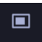 85% | Set it to **85%**, leaving a little neighboring content in view. |
| 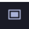 Full | Set it to **100%** of the available workspace width. This is a column size, not fullscreen. |

These choices apply to the **whole native column**, including any windows stacked
in it. For a vertically scrolling layout, the controls refer to column height.
They are manual choices: Gooey installs no automatic per-app width rules.

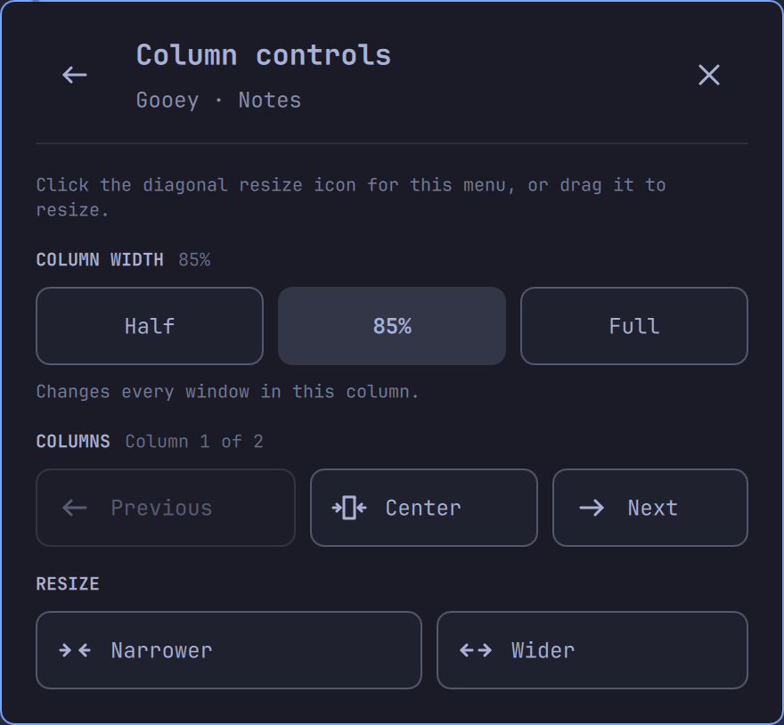

- **Half / 85% / Full:** set an explicit column size; the selected size is highlighted.
- **Previous / Next:** focus the neighboring column in the indicated direction.
- **Center:** center this column in the scrolling viewport.
- **Narrower / Widen:** adjust size incrementally rather than choosing a preset.
- Unavailable neighbors are disabled. Dwindle split/swap controls are absent here.

For a comfortable scrolling setup, try one column at 85% and others at half width.
You can change the mix whenever you like; Gooey keeps Hyprland in charge of tiling.

## Window actions: three different ways to fill space

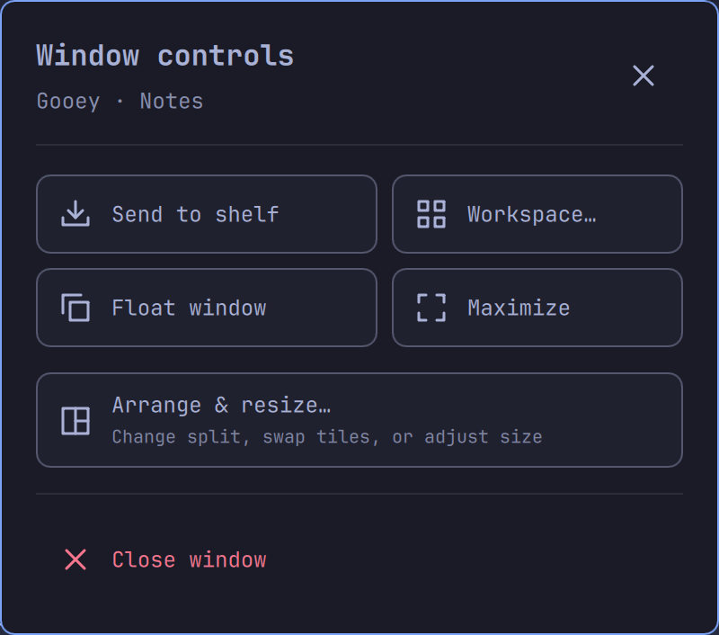

| Choice | What fills the screen? | How to return |
| --- | --- | --- |
| Frame **Fullscreen** | True fullscreen; Hyprland hides Gooey’s frame and desktop controls. | **Super+F**. |
| Menu **Maximize** | The available workspace, with Gooey’s frame and desktop controls retained. | Open Actions and choose **Restore size**. |
| Scrolling **Full** | This native column becomes 100% width; the scrolling layout remains active. | Choose **Half** or **85%**. |

**Float window** takes the window out of tiling so it can move and size freely.
**Tile window** returns it to the current layout. **Close window** in this menu
closes the app window; the popup’s header X only dismisses the menu.

## Send a window to another workspace

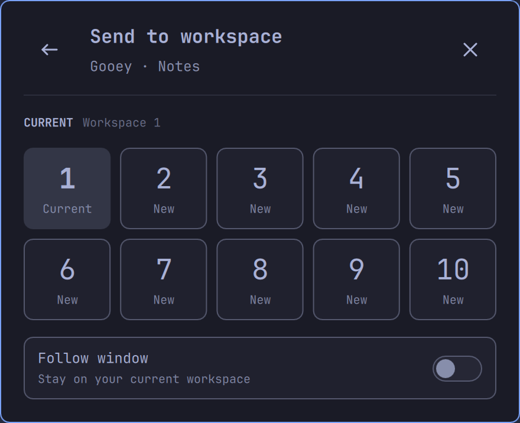

Choose a numbered or configured named workspace. **Follow window is off by
default:** the app moves, and you stay on your current workspace. Turn Follow on
when you want to switch to the destination with it. Workspace selection does not
silently enable Follow for later moves.

## Put an app on the Shelf, then bring it back

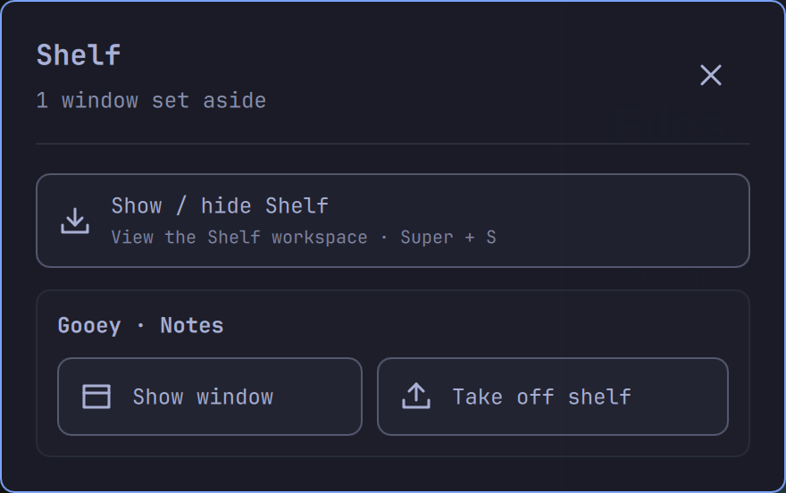

| Control | What it does |
| --- | --- |
| **Show / hide Shelf** | Toggle the special Shelf workspace, like Super+S. |
| **Show window** | Focus the selected shelved app so you can use it on the Shelf. |
| **Take off shelf** / 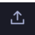 | Return the selected app to a normal workspace. |
| Popup **X** | Close the list, leaving its apps running. |

The Shelf is Omarchy’s special scratchpad workspace, not a traditional minimize
state. Your app keeps running. Click the Shelf icon on the desktop bar to find
shelved windows and use **Take off Shelf** to bring one back. The window-frame
Shelf button reverses when the window is already shelved. The menu can also open
the Shelf workspace. **Super+S** continues to toggle that workspace.

## Apps, desktop settings, and the Gooey switch

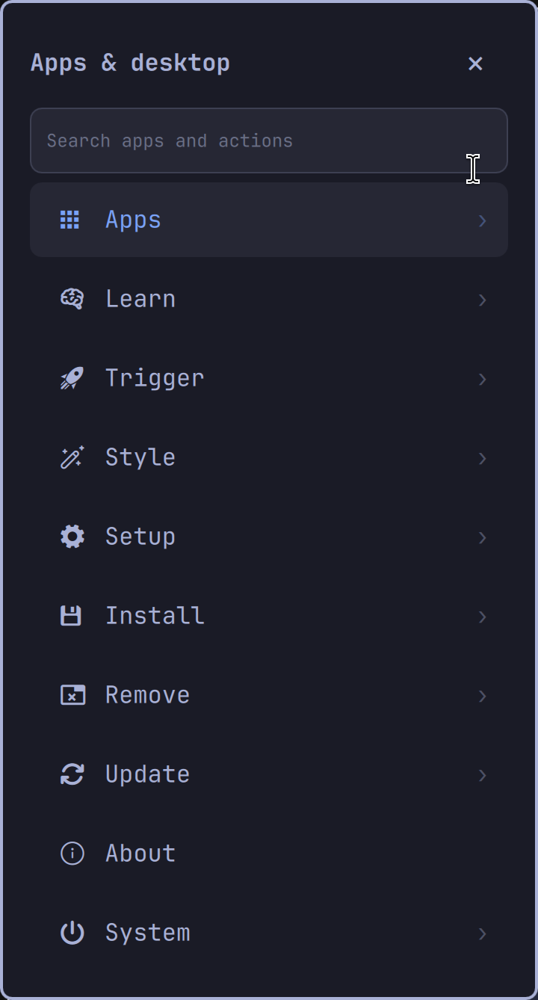

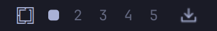

The leftmost logo opens the launcher; the downward-arrow tray opens the Shelf.
The numbered workspace indicators between them belong to Omarchy.

Click the **Omarchy logo** on the bar to open this Quickshell menu. Search for an
app or browse the menu with the mouse. The right Super key opens the same menu;
stock Super+Space remains available. The menu anchors to the logo and follows it
when the bar is moved to another edge or the button is reordered.

- **Search field:** type to filter; the clear control removes the query.
- **Rows with a chevron:** open a submenu.
- **Back arrow:** go up one menu level.
- **Header X:** dismiss the launcher.
- Omarchy supplies the desktop-setting actions shown in this menu.

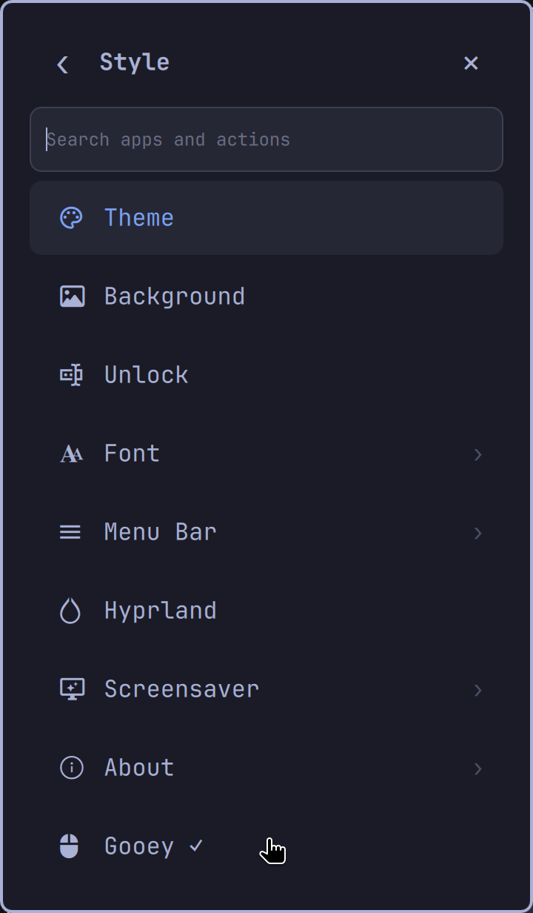

Open **Style → Gooey** to switch the installed experience on or off. **✓** means
it is enabled. The option remains in stock Omarchy’s menu after Gooey is disabled.
This is a selector for an installed build, not an installer or updater.

If needed, run `gooey disable` or use the **Restore stock Omarchy** application
entry. See [installation and recovery](INSTALL.md) for backups and update steps.

## Mouse and keyboard together

Gooey makes common actions discoverable without a shortcut cheat sheet. It does
not remove your choice to use shortcuts. Drag a window with the mouse, switch a
workspace with a keybinding, and open another app from the bar—use whatever feels
natural. True fullscreen currently still needs Super+F to return; Niri and a
complete mouse-only workflow are future work.
